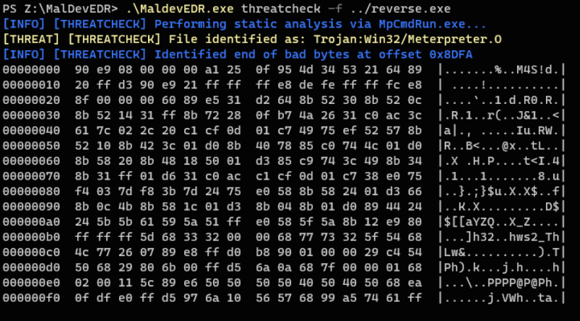
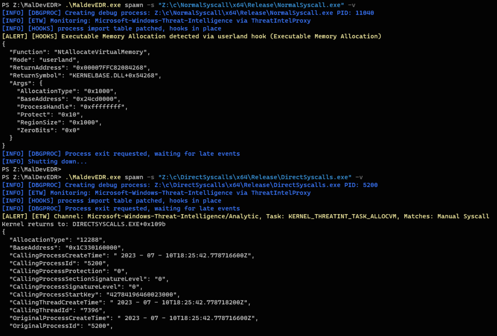

# !!! THIS IS NOT A REAL EDR/AV SOLUTION, DO NOT USE IN A PRODUCTION ENVIRONMENT !!!

MaldevEDR is a tool that can be used for malware development, in a red team environment to provide situational awareness.  It is not designed to spot/analyze/prevent malware for IR or forensics. The main purpose of this tool is to give malware devs insight into what AV/EDR can and can't see. MaldevEDR does not block or alter excution in any way, it simply alerts with information.  It is designed to be configurable so we can adapt to different EDR vendors and new tactics. 

I am not a real dev nor an expert in anything. In fact one of the reasons I started this project was to learn more about detections,ETW, Windows API and C. So Im sure there are issues in this code, it has been a challenge to develop while learning all this, so by all means if you see something wrong or think you can make something better create an issue or message me, I would love the input. 


## ToDo
- [ ] develop some real rules, currently the config only has a few test rules
- [ ] finish the attach mode.  bare bones functionlity is there, but some recent changes in dbgproc may have broke it.
- [ ] learn to be a real C dev so I can make the EDR dll great again
- [ ] add more NTAPI hooks, currently only NtAllocateVirtualMemory is implented for testing.
- [ ] leverage the CREATE_PROCESS_DEBUG_EVENT to monitor/inject processes created by the malware.
- [ ] need a way to lock logger output so we dont stomp/mix outputs.
- [ ] de-dupe etw events, some come in twice, especially hooked funcs


#### Notes:
- spawned processes are initially created suspened, debugger is attached, and then resumed. Debug API has 2 advantages, 1. we can prevent the process from exiting until we are finished, 2. we can use OUTPUT_DEBUG_STRING_EVENT for communication with the DLL. 
- spawned process occasionally crash/hang. I suspect this either an issue with my C skills in the DLL or an issue in the debugger routine logic. Working on this.
- the use of expr is a security risk, its essentially an eval on user supplied data, but again this should not run anywhere but a dedicated malware VM.

# Modes
## ThreatCheck
- Performs static analysis on a file using Defenders CLI.  This a plain and simple rip-off of Rasta-Mouse's ThreatCheck, just ported to Golang for use in this project.

## Spawn
- spawns the malicious file as a debug process, monitors ETW for related events and injects the EDR dll into the process to hoo API calls.
- options to set cmdline,startup dir and environ vars. for testing dlls, binaries that require flags, or sideloading.
- generic symbol resolution for ETW stack trace, and hooked func return addresses. 

## Attach
- work is in progress, not all functionality is ready in attach yet.
- essentially the same as Spawn, but attaches to a process that is already running.

## Monitor
- just monitors ETW and hooks pipe, for testing your own stuff er whatever.

# ETW
- Only PPL processes are allowed to monitor the Threat Intel feed. Sysmon is moving to this in the future. As such, I have included an event proxy (ThreatIntelProxy) that you can run as a ppl. It will monitor ppl channels, and forward them to a named pipe, which the EDR monitors. How you run this is up to you, see below for info on using KDU to run it via vulnerable drivers.
- if you spawn or attach to a process for any ETW monitoring, all rules are appended with a matcher for the process name or pid automatically.

# Hooks
- hooks are performed via a DLL that is injected into the process. there are 2 modes for spawned processes, import table injection, and standard CreateRemoteThread injection. Default is import table injection since it is far more likeley to catch early calls.
- my C skills suck, so the EDR DLL is pretty basic, mostly copy/paste code. The dll is DetoursNt based, only depends on ntdll really, but includes kernel32 api for simplicity. This needs lots of work if anyone is interested in collaborating.
- data is communicated to the EDR client via debugger messages. Initially I planned to use another named pipe, but since the DLL is loaded early, and has very minimal dependencies, pipe comms were causing issues. A good C dev could make this work.
- import table injection is currently handled by a Detours helper dll. I am close to a functional x64 Golang implementation of x86Mathews ImportDllInjection PoC, but there are some issues still. 


# Rules
- see QUERY_LANGUAGE.md for syntax info.  Uses the expr package to parse logic with a few extras.
- configured in the yaml file or set on the command line
- etw and hooks have options to disable,override,append rules.
- for deloping rules, use the verbose options + --rule-dev, this will print out what the final query passed to expr looks like.

# Other stuff
## ThreatIntelProxy
 This is a side tool used to forward events from PPL providers to the named pipe "\\\\.\\pipe\\MalDevEDR\\events". It uses the same config file for etw. This must be run as a PPL process, how you do that is up to you. The quickest way to get started is to configure the vulnerable drivers block list in your VM, and execute it with https://github.com/hfiref0x/KDU.git.  This will use a vulnerable driver to execute the proxy as a PPL, and allow it to recieve events from Microsoft-Windows-Threat-Intelligence and Sysmon (Moving to PPL in newer releases)
 
 ```
kdu.exe -prv 1 -pse "ThreatIntelProxy.exe" 
 ```
once the proxy is started, you can run MaldevEDR in etw or analyze mode, and it will capture the events.


# Screenshots 

