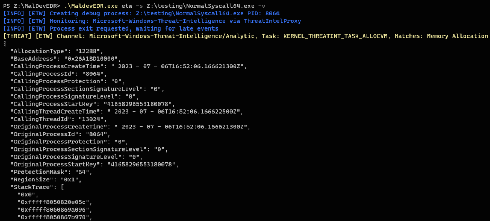
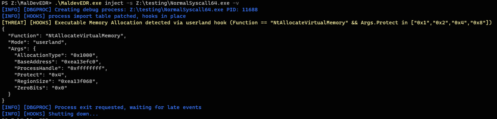
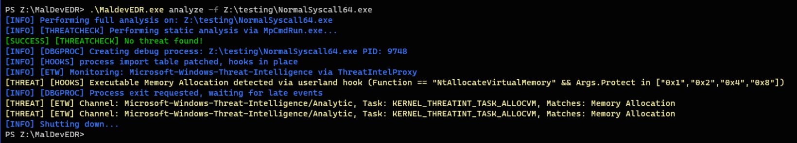

# !!! THIS IS NOT A REAL EDR/AV SOLUTION, DO NOT USE IN A PRODUCTION ENVIRONMENT !!!

This project is still in initial development.  Some functionality is working, some is not. Im sure there are issues in this code, it has been a challenge to develop while learning all this, so by all means if you see something or think you can make something better create an issue or message me, I would love the input.

## Module Status
- [x] Threatcheck
- [x] ETW
- [x] DLL injection/hooks implemented, but minimal functionality
- [x] ThreatIntelProxy is functional, but needs refining


MaldevEDR is a project I created to serve 2 purposes. 
1. I wanted to learn more about Windows API, and how detections work, 
2. Provide a tool that Red Teams can use during malware development, to gain insight into what target EDR/AV may see during an engagement.  

MaldevEDR does not block/alter/prevent anything, it simply alerts with information. It is designed to be configurable so we can adapt to different EDR vendors and new tactics.


## TODO
- [ ] De-dupe etw events, some come in twice, especially hooked funcs
- [ ] Devlop some real rules for the etw config. As of right now its just test rules.
- [ ] Implement more hooks in the dll and add some real rules to spot malicious calls.
- [ ] Work on symbol resolution in ETW stack traces, code is there but it can be buggy
- [ ] Fill in the cobra cmd descriptions with real info.

# Modules
## ThreatCheck
- Performs static analysis on a file using Defenders CLI.  This a plain and simple rip-off of Rasta-Mouse's ThreatCheck, just ported to Golang for use in this project.


## ETW
- Monitors various providers and alerts on events that match user specified rules.
- Some ETW providers require PPL such as Defenders Threat Intel. These are handled differently than normal providers. See ThreatIntelProxy below.
- ETW rules are handled application side instead passing them to the provider/consumer. This allows us to perform more checks using a custom query language.
- ETW has an option to provide stack tracing in events (very little documentation on this). This can be enabled per provider in the config file via "stacktrace: true", but this is fairly resource intensive so use sparingly. May be handy for detecting syscalls if we can get symbol resolution working. e.g. if NtProtectVirtualMemory returns to userland code instead of ntdll.
- See QUERY_LANGUAGE.md for more information on rule syntax




## Inject
- shoutout p4yl0ad for helping me figure out the Hooking issue.
- injects a DetoursNT based hooking dll into the target. Injection is via import address table patching, normal createthread misses anything that happens early.
- since dll is injected right after ntdll, dependencies are limited, which is why im using DetoursNT.
- hooks common ntdll functions like NtAllocateVirtualMemory and uses instrumentation callbacks to detect manual syscalls that return to userland (direct syscalls), still working on this.
- hooked functions generate a JSON event, these can be matched using the same syntax as ETW, see the config.yaml for examples
- hooked functions communicate with MalDevEDR via the named pip "\\\\.\\pipe\\MalDevEDR\\events"
- currently the actual injection is performed using the EDRHelper.dll. Its just a wrapper around DetourUpdateProcessWithDll. Working on a go implementation of x86mathews import address table injection poc.




## Analyze
- performs all checks.



## ThreatIntelProxy
 This is a side tool used to forward events from PPL providers to the named pipe "\\\\.\\pipe\\MalDevEDR\\events". It uses the same config file for etw. This must be run as a PPL process, how you do that is up to you. The quickest way to get started is to configure the vulnerable drivers block list in your VM, and execute it with https://github.com/hfiref0x/KDU.git.  This will use a vulnerable driver to execute the proxy as a PPL, and allow it to recieve events from Microsoft-Windows-Threat-Intelligence and Sysmon (Moving to PPL in newer releases)
 ```
kdu.exe -prv 1 -pse "ThreatIntelProxy.exe" 
 ```
once the proxy is started, you can run MaldevEDR in etw or analyze mode, and it will capture the events.

#### Notes:
- spawned processes are initially created suspened, debugger is attached, and then resumed. I may add options in the future to use a normal os.Exec() if we need to avoid DEBUG.
- if you spawn a process for any ETW monitoring, all rules are appended with a matcher for the process name or pid automatically.
- the use of expr is a security risk, its essentially an eval on user supplied data, but again this should not run anywhere but a dedicated malware VM.


